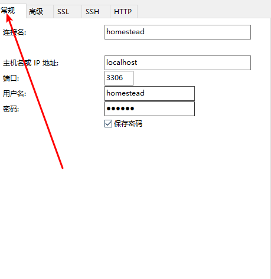

## laravel homestead 
### 环境说明
---
- 演示的工作目录位置：`F:\vrun\projects`
- 如果已存在`.ssh `目录请跳过，没有则执行 `ssh-keygen`
- 版本:
    - homestead: v7.0.1
    - Vagrant:  2.0.1
    - virtualBox: 5.1.30
    - box: v5.0.1

### 详细步骤
---
#### 新建metadata.json
```json
{
    "name": "laravel/homestead",
    "versions": 
    [
        {
            "version": "5.0.1",
            "providers": [
                {
                  "name": "virtualbox",
                  "url": "homestead.box" # 路径为metadata.json的同级目录
                }
            ]
        }
    ]
}
```

#### 导入homestead.box
```bash
vagrant box add metadata.json
```


#### 安装全局安装homestead
```bash
composer global require laravel/homestead
```

#### 进入工作目录
1. 安装homestead的package
```bash
composer require laravel/homestead
```
2. `homestead make` （全局安装的homestead命令）
>生成如下文件：
```bash
Homestead.yaml
after.sh
aliases
Vagrantfile
```

#### 在工作目录下运行 `vagrant up`


### 远程访问
---
#### 初始化的信息
1. 端口映射
    - SSH: 2222 → 发送到 22
    - HTTP: 8000 → 发送到 80
    - HTTPS: 44300 → 发送到 443
    - MySQL: 33060 → 发送到 3306
    - Postgres: 54320 → 发送到 5432
    - Mailhog: 8025 → 发送到 8025

2. 主机信息
    - ip：192.168.10.10
    - ssh登录用户名: vagrant
    - ssh登录密码: vagrant

#### 远程连接mysql

> 使用的是mysql客户端：navicat

1. 新建mysql的连接
2. 切换tab到ssh，填写ssh的信息。

    **ip：192.168.10.10** <br>
    **用户名：vagrant** <br/>
    **密码：vagrant** <br/>

  

3. 配置mysql

    **ip：127.0.0.1** <br/>
    **port：3306** <br/>
    **用户名：homestead** <br/>
    **密码：secret** <br/>
    
 


### 配置文件
---
```yaml
ip: 192.168.10.10
memory: 2048
cpus: 1
provider: virtualbox
authorize: ~/.ssh/id_rsa.pub
keys:
    - ~/.ssh/id_rsa
folders: # 多个共享文件夹
    -
        map: 'F:\code'
        to: /home/vagrant/code
    - 
        map: 'F:\run'
        to: /home/vagrant/run

sites: # 多个站点
    -
        map: blog1.test
        to: /home/vagrant/code/blog1/public
    -
        map: blog2.test
        to: /home/vagrant/code/blog2/public

databases: # 多个数据库
    - homestead1
    - homestead2

name: huid # VM name
hostname: huid

```
