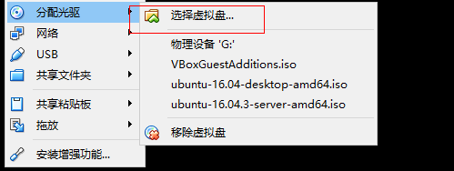

> 以下操作都是以root身份
### 预装软件
```bash
  apt update
  apt upgrade #To install Linux headers
  apt install gcc
  apt install make
```

### 先分配光驱给linux系统


***选择VBoxGuestAdditions.iso。一般在vbox的安装目录有***

### 挂载，安装增强工具
- 进入命令行界面，将CD进行挂载
```bash
mount /dev/cdrom /cdrom #cdrom是自己创建的文件夹
```
- 进入cdrom并运行相关程序
```bash
cd /cdrom
./VBoxLinuxAdditions.run
reboot
```

### 配置共享文件夹
1. 点击运行的虚拟机设备
2. 共享文件夹设置
3. 机器文件，添加共享文件夹
4. 选中创建的文件夹，填写名字，选择永久分配
5. 点击确定

### 挂载共享文件夹
```bash
mount -t vboxsf share【这里是指主机文件夹名】 share【这里是指终端挂载的文件夹名】
```

> [参考1](http://f.dataguru.cn/thread-456235-1-3.html)
> [参考2](https://askubuntu.com/questions/810980/unable-to-install-virtual-box-guest-additions-on-lubuntu-16-04)

